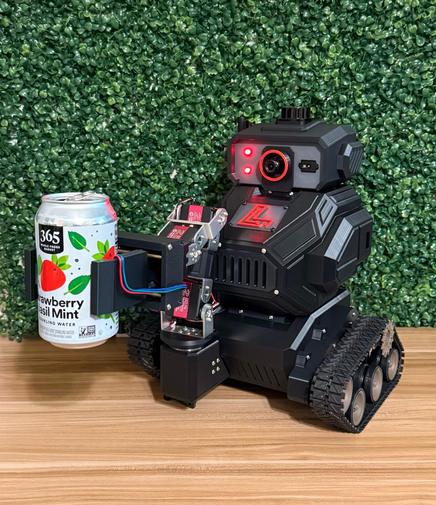

# wilson



An AI enabled robot. Wilson can interact with the user and world through audio/visual input and audio output. Wilson's main directive is to retrieve the user's desired beverage from a mini fridge!

Wilson was custom designed in SolidWorks and 3D printed at home. 

## Try the simulation yourself! 🐳

<details>
<summary><strong>🐧 Linux Setup Instructions</strong></summary>

Follow these steps to set up Docker and run Wilson's simulation:

### Prerequisites Setup

**⚠️ Important:** You will need root or sudo access to complete these steps.

1. **Update system packages and install prerequisites:**
   ```bash
   sudo apt update
   sudo apt install -y git curl
   ```

2. **Clone Wilson repository:**
   ```bash
   git clone https://github.com/tracelarue/wilson.git
   cd wilson
   ```

3. **Create API key file** (for AI voice/text commands):
   Create a `.env` file in the wilson directory with your Google API key:
   ```bash
   echo "GOOGLE_API_KEY=your_api_key_here" > .env
   ```
   Replace `your_api_key_here` with your actual Google Gemini API key from [Google AI Studio](https://aistudio.google.com). Without this file, Wilson will work but won't have AI-powered voice commands and object recognition capabilities.

4. **Install Docker:**
   ```bash
   curl -fsSL https://get.docker.com -o get-docker.sh
   sudo sh get-docker.sh
   ```

5. **Configure Docker permissions (Optional):**
   If you don't want to use `sudo` with docker commands:
   ```bash
   sudo groupadd docker
   sudo usermod -aG docker $USER
   ```
   **Note:** We'll use `sudo` for simplicity in the following steps.

6. **Check Docker service:**
    ```bash
    systemctl is-enabled docker
    ```
    If the output is not `enabled`, start and enable Docker with:
    ```bash
    sudo systemctl start docker
    sudo systemctl enable docker
    ```

7. **Configure X11 forwarding for GUI applications:**
   ```bash
   echo "xhost +" >> ~/.bashrc
   echo "xhost +local:docker" >> ~/.bashrc
   ```

### Running Wilson Simulation
Run these commands with `sudo` privileges:

1. **Pull the ROS 2 base image:**
   ```bash
   sudo docker image pull osrf/ros:humble-desktop-full
   ```

2. **Build Wilson's Docker image** (must be run from the wilson directory):
   ```bash
   sudo docker build -t wilson_image .
   ```

3. **Run the Wilson container:** (must be run from the wilson directory):
   ```bash
   sudo docker run -it --user ros --network=host --ipc=host \
     -v $PWD:/wilson \
     -v /tmp/.X11-unix:/tmp/.X11-unix:rw \
     --env=DISPLAY=:0 \
     --env=QT_X11_NO_MITSHM=1 \
     -v /dev:/dev \
     --privileged \
     --name wilson \
     wilson_image
   ```


### Starting the Simulation

Once inside the container, start Wilson's simulation with:

```bash
colcon build --symlink-install && source install/setup.bash && ros2 launch wilson wilson_sim.launch.py
```

### Controlling Wilson 🎮

After the simulation launches, you have multiple ways to control Wilson:

- **RViz Panels**: Use the Nav2 and MoveIt panels in RViz for navigation and manipulation
- **Teleop Keyboard**: Control Wilson directly with keyboard inputs
- **AI Voice/Text Commands**: Talk or type to Gemini for natural language control

#### AI Commands Examples:
- "Go to the kitchen"
- "Go to the living room" 
- "Go to the mini fridge"
- "What do you see?"
- "Find the 3D position of [object]" - This will display a marker in RViz showing the detected object's location

Wilson combines autonomous navigation, manipulation, and AI-powered interaction to create an intelligent robotic assistant!

### Container Management

**Execute commands in a running container:**
If Wilson is already running in a container, you can access it with:
```bash
sudo docker exec -it wilson /bin/bash
```

<details>
<summary><strong>🐳 Common Docker Commands</strong></summary>

Here are some useful Docker commands for managing Wilson:

```bash
# List all containers (running and stopped)
sudo docker ps -a

# Stop the Wilson container
sudo docker stop wilson

# Start an existing Wilson container
sudo docker start wilson

# Remove the Wilson container
sudo docker rm wilson

# Remove the Wilson image
sudo docker rmi wilson_image

# View container logs
sudo docker logs wilson

# View real-time logs
sudo docker logs -f wilson
```

</details>

</details>

<details>
<summary><strong>🪟 Windows Setup Instructions</strong></summary>

Follow these steps to set up Docker Desktop and run Wilson's simulation on Windows:

### Prerequisites Setup

**⚠️ Important:** You will need administrator access to complete these steps.

1. **Update system and install prerequisites:**
   - Ensure Windows 10 version 2004 or higher, or Windows 11
   - Enable WSL 2 (Windows Subsystem for Linux)
   - Install Git for Windows from [git-scm.com](https://git-scm.com/download/win)

2. **Install or Update WSL:**
   Open PowerShell as Administrator and run:
   ```powershell
   wsl --install
   wsl --update
   ```
   Restart your computer if prompted.

3. **Verify WSL installation:**
   ```powershell
   wsl --version
   ```

4. **Clone Wilson repository:**
   Open Command Prompt or PowerShell and run:
   ```cmd
   git clone https://github.com/tracelarue/wilson.git
   cd wilson
   ```

5. **Create API key file** (for AI voice/text commands):
   Create a `.env` file in the wilson directory with your Google API key:
   ```cmd
   echo GOOGLE_API_KEY=your_api_key_here > .env
   ```
   Replace `your_api_key_here` with your actual Google Gemini API key from [Google AI Studio](https://aistudio.google.com). Without this file, Wilson will work but won't have AI-powered voice commands and object recognition capabilities.

6. **Install Docker Desktop:**
   - Download Docker Desktop from [docker.com](https://www.docker.com/products/docker-desktop/)

7. **Configure Docker Desktop:**
   - Start Docker Desktop from the Start Menu
   - Ensure WSL 2 backend is enabled in Docker Desktop settings
   - Make sure "Use Docker Compose V2" is enabled

### Running Wilson Simulation

1. **Open PowerShell or Command Prompt as Administrator** and navigate to the wilson directory:
   ```cmd
   cd path\to\wilson
   ```

2. **Pull the ROS 2 base image:**
   ```cmd
   docker image pull osrf/ros:humble-desktop-full
   ```

3. **Build Wilson's Docker image:**
   ```cmd
   docker build -t wilson_image .
   ```

4. **Run the Wilson container:**
   ```cmd
   docker run -it --user ros --network=host --ipc=host -v %cd%:/wilson --env=DISPLAY=host.docker.internal:0 -p 9000:9000 --privileged --name wilson wilson_image
   ```

### X11 Forwarding for GUI (Optional)

For GUI applications on Windows, you may need an X11 server:

1. **Install VcXsrv or Xming:**
   - Download VcXsrv from [sourceforge.net](https://sourceforge.net/projects/vcxsrv/)
   - Install and configure with "Disable access control" checked

2. **Start X11 server** before running Docker containers

### Starting the Simulation

Once inside the container, start Wilson's simulation with:

```bash
colcon build --symlink-install && source install/setup.bash && ros2 launch wilson wilson_sim.launch.py
```

### Controlling Wilson 🎮

After the simulation launches, you have multiple ways to control Wilson:

- **RViz Panels**: Use the Nav2 and MoveIt panels in RViz for navigation and manipulation
- **Teleop Keyboard**: Control Wilson directly with keyboard inputs
- **AI Voice/Text Commands**: Talk or type to Gemini for natural language control

#### AI Commands Examples:
- "Go to the kitchen"
- "Go to the living room" 
- "Go to the mini fridge"
- "What do you see?"
- "Find the 3D position of [object]" - This will display a marker in RViz showing the detected object's location

Wilson combines autonomous navigation, manipulation, and AI-powered interaction to create an intelligent robotic assistant!

### Container Management

**Execute commands in a running container:**
If Wilson is already running in a container, you can access it with:
```cmd
docker exec -it wilson /bin/bash
```

<details>
<summary><strong>🐳 Common Docker Commands (Windows)</strong></summary>

Here are some useful Docker commands for managing Wilson on Windows:

```cmd
# List all containers (running and stopped)
docker ps -a

# Stop the Wilson container
docker stop wilson

# Start an existing Wilson container
docker start wilson

# Remove the Wilson container
docker rm wilson

# Remove the Wilson image
docker rmi wilson_image

# View container logs
docker logs wilson

# View real-time logs
docker logs -f wilson

# Check Docker Desktop status
docker system info

# Check available disk space
docker system df
```

</details>

</details>

