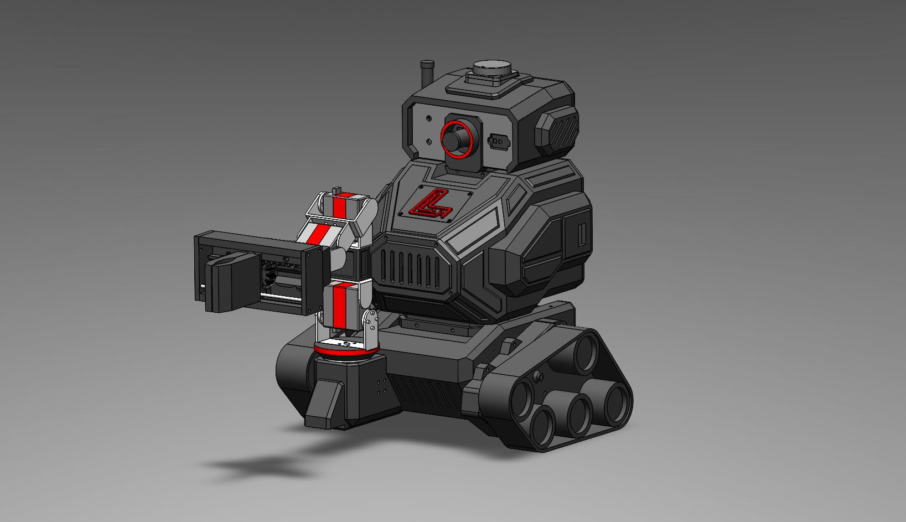

# Wilson 🤖
*An Autonomous Assistant Robot with Conversational AI*

Updated (9/28/25)


## About Wilson

Wilson is an autonomous robot featuring a differential drive base and a 4-DOF manipulator arm, designed to be your personal beverage assistant! With Google's Gemini Live API integration, Wilson can conversationally interact with users and execute tasks based on natural language requests. His main directive? **Getting you a drink from the mini fridge!** *(coming soon)*

### Why I Built Wilson

I wanted to create a robot that could bridge the gap between advanced AI capabilities and real-world physical interaction. The goal was to build something that wasn't just impressive technically, but actually useful in daily life - starting with the simple but satisfying task of fetching drinks on command.

### How Wilson Works

Wilson operates on **ROS2 Humble** and combines several cutting-edge technologies:

**🧠 AI & Interaction:**
- Google Gemini Live API for natural conversation and task understanding
- Real-time audio/visual processing for environmental awareness
- Tool execution based on conversational commands

**🔧 Hardware:**
- **Computing**: Raspberry Pi 5 (8GB) as the main brain
- **Control**: 2 Arduino Nanos for drive and arm control
- **Sensors**: 
  - 360° LD-19 LiDAR for navigation and mapping
  - AruCam ToF camera for depth perception  
  - USB camera for visual recognition
  - Novel soft 3D force sensor in the gripper (developed by Dr. Jonathan Miller, et al. at University of Kansas)

**🎨 Design & Manufacturing:**
I designed every component of Wilson (except the tracks/wheels) in SolidWorks and 3D printed the entire chassis and manipulator at home. You can see the design evolution below:


*SolidWorks CAD Design - The original 3D model*

## Simulation & Testing �
Wilson's simulation leverages both **Gazebo** and **RViz** for a complete robotics development workflow:

### Gazebo Simulation

Gazebo provides a realistic 3D environment where Wilson's physical model, sensors, and actuators are simulated. You can visualize Wilson navigating, manipulating objects, and interacting with its environment just like in the real world. The simulation includes:

- Physics-based movement and collisions
- Sensor emulation (LiDAR, cameras, force sensors)
- Interactive objects (e.g., mini fridge, beverage cans)

### RViz Visualization

RViz is used for visualizing sensor data, robot state, and planning. In Wilson's simulation, RViz displays:

- Real-time LiDAR scans and camera feeds
- Navigation maps and planned paths
- Manipulator arm trajectories
- Detected objects and AI-generated markers

You can use RViz panels to send navigation goals, control the arm, and monitor AI perception outputs. This combination of Gazebo and RViz enables rapid testing and debugging of Wilson's autonomous and conversational capabilities before deploying to hardware.


*[Gemini Demo Video](pictures/Gemini_demo_video.mp4) - See Wilson's AI in action*

## Try the simulation yourself! 🐳

<details>
<summary><strong>🐧 Linux Setup Instructions</strong></summary>

Follow these steps to set up Docker and run Wilson's simulation:
(Tested on Ubuntu 22.04, latest Docker)
### Prerequisites Setup

**⚠️ Important:** You will need root or sudo access to complete these steps.

1. **Update system packages and install prerequisites:**
   ```bash
   sudo apt update
   sudo apt install -y git curl
   ```

2. **Clone Wilson repository:**
   ```bash
   git clone https://github.com/tracelarue/wilson.git
   cd wilson
   ```

3. **Create API key file** (for AI voice/text commands):
   Create a `.env` file in the wilson directory with your Google API key:
   ```bash
   echo "GOOGLE_API_KEY=your_api_key_here" > .env
   ```
   Replace `your_api_key_here` with your actual Google Gemini API key from [Google AI Studio](https://aistudio.google.com). Without this file, Wilson will work but won't have AI-powered voice commands and object recognition capabilities.

4. **Install Docker:**
   ```bash
   curl -fsSL https://get.docker.com -o get-docker.sh
   sudo sh get-docker.sh
   ```

5. **Configure Docker permissions (Optional):**
   If you don't want to use `sudo` with docker commands:
   ```bash
   sudo groupadd docker
   sudo usermod -aG docker $USER
   ```
   **Note:** We'll use `sudo` for simplicity in the following steps.

6. **Check Docker service:**
    ```bash
    systemctl is-enabled docker
    ```
    If the output is not `enabled`, start and enable Docker with:
    ```bash
    sudo systemctl start docker
    sudo systemctl enable docker
    ```

7. **Configure X11 forwarding for GUI applications:**
   ```bash
   echo "xhost +" >> ~/.bashrc
   echo "xhost +local:docker" >> ~/.bashrc
   ```

### Running Wilson Simulation
Run these commands with `sudo` privileges:

1. **Pull the ROS 2 base image:**
   ```bash
   sudo docker image pull osrf/ros:humble-desktop-full
   ```

2. **Build Wilson's Docker image** (must be run from the wilson directory):
   ```bash
   sudo docker build -t wilson_image .
   ```

3. **Run the Wilson container:** (must be run from the wilson directory):
   ```bash
   sudo docker run -it --user ros --network=host --ipc=host \
     -v $PWD:/wilson \
     -v /tmp/.X11-unix:/tmp/.X11-unix:rw \
     --env=DISPLAY=:0 \
     --env=QT_X11_NO_MITSHM=1 \
     -v /dev:/dev \
     --privileged \
     --name wilson \
     wilson_image
   ```


### Starting the Simulation

Once inside the container, start Wilson's simulation with:

```bash
colcon build --symlink-install && source install/setup.bash && ros2 launch wilson wilson_sim.launch.py
```

### Controlling Wilson 🎮

After the simulation launches, you have multiple ways to control Wilson:

- **RViz Panels**: Use the Nav2 and MoveIt panels in RViz for navigation and manipulation
- **Teleop Keyboard**: Control Wilson directly with keyboard inputs
- **AI Voice/Text Commands**: Talk or type to Gemini for natural language control

#### AI Commands Examples:
- "Go to the kitchen"
- "Go to the living room" 
- "Go to the mini fridge"
- "What do you see?"
- "Find the 3D position of [object]" - This will display a marker in RViz showing the detected object's location

Wilson combines autonomous navigation, manipulation, and AI-powered interaction to create an intelligent robotic assistant!

### Container Management

**Execute commands in a running container:**
If Wilson is already running in a container, you can access it with:
```bash
sudo docker exec -it wilson /bin/bash
```

<details>
<summary><strong>🐳 Common Docker Commands</strong></summary>

Here are some useful Docker commands for managing Wilson:

```bash
# List all containers (running and stopped)
sudo docker ps -a

# Stop the Wilson container
sudo docker stop wilson

# Start an existing Wilson container
sudo docker start wilson

# Remove the Wilson container
sudo docker rm wilson

# Remove the Wilson image
sudo docker rmi wilson_image

# View container logs
sudo docker logs wilson

# View real-time logs
sudo docker logs -f wilson
```

</details>

</details>

<details>
<summary><strong>🪟 Windows Setup Instructions</strong></summary>

Windows support is coming soon! 🚧

I'm working on comprehensive Windows setup instructions with Docker Desktop and WSL 2 integration. Check back soon for the complete Windows installation guide.

</details>

