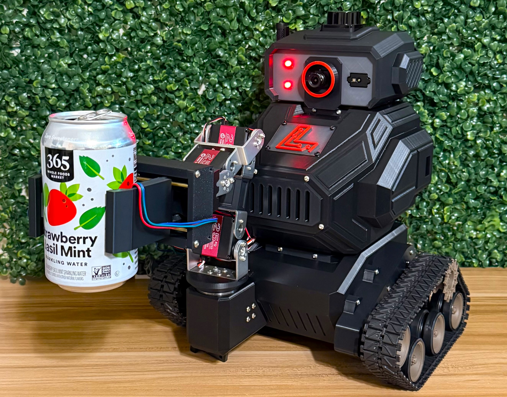
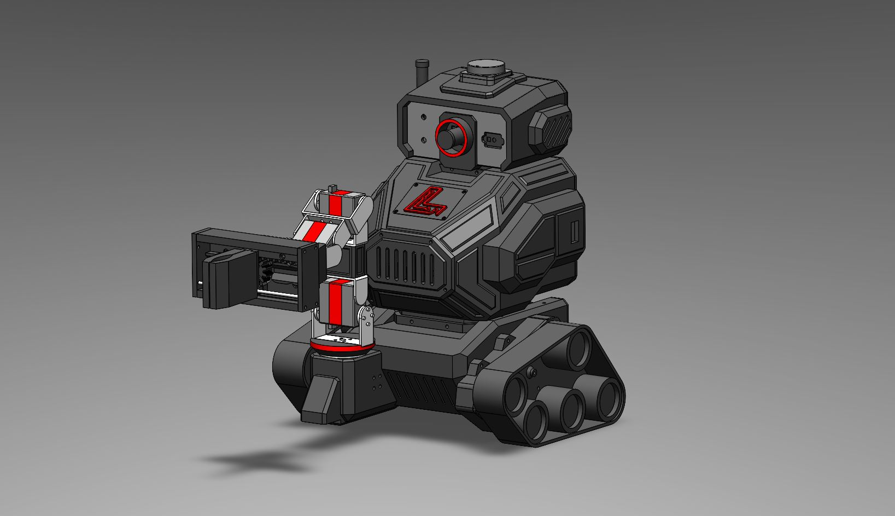
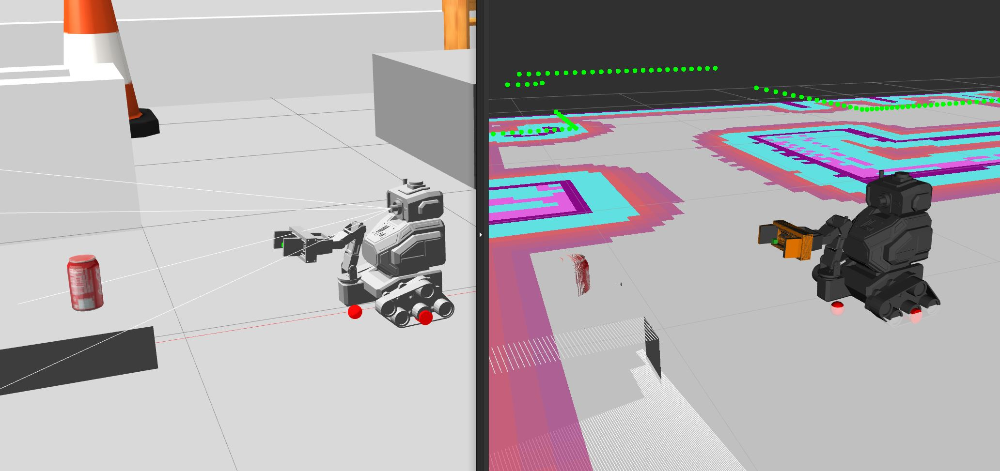

# Wilson 🤖
A robot for autonomous beverage retrieval, powered by Gemini

Updated (9/30/25)

## About Wilson

Wilson is an autonomous robot featuring a differential drive base and a 4-DOF manipulator arm, designed to be your personal beverage assistant! With Google's Gemini Live API, Wilson can conversationally interact with users and execute tasks based on natural language requests. His main directive? **Getting you a drink from the mini fridge!** *(in development)*

### Why I Built Wilson

I wanted to create a robot that could bridge the gap between advanced AI capabilities and real-world physical interaction. The goal was to build something impressive technically, build a robust set of robotics skills, and impress any guest who comes to my house - starting with the simple (but apparently not so simple), satisfying task of fetching drinks on command.

### How Wilson Works

Wilson operates on **ROS2 Humble** and combines a wide range of hardware and sensors:

**🧠 AI & Interaction:**
- Google Gemini Live API for natural conversation and task understanding
- Real-time audio/visual processing for environmental awareness
- Tool execution based on conversational commands

**🔧 Hardware:**
- **Computing**: Raspberry Pi 5 (8GB) as the main brain
- **Control**: 2 Arduino Nanos for drive and arm control
- **Sensors**: 
  - LD-19 LiDAR for navigation and mapping
  - AruCam ToF camera for depth perception  
  - USB camera for visual recognition
  - Microphone for listening to the user
  - Novel soft 3D force sensor in the gripper (developed by Dr. Jonathan Miller, et al. at the University of Kansas)
- **Motors**:
  - 2, GA37-520 DC motors with integrated encoders
  - 5, 20 kg digital servos
- **Power**:
  - 3S, 5200 mAh LiPo battery
- **Other**:
  - USB Speaker for responding to the user

## 🦾🔨 Design & Manufacturing

*SolidWorks CAD Design - The original 3D model*

I designed every component of Wilson (except the tracks/wheels) in SolidWorks and 3D printed the entire chassis and manipulator at home.

Wilson was designed with modularity and servicability in mind. The head, body, base, and track mounts are all seperate components to allow for easier fixes and design changes down the road. 

All of Wilson's electronic components are mounted internally on a modular rail system. This allows for easy removal of components for fixing or upgrading.

## Simulation & Testing 👨‍💻
Wilson's simulation leverages both **Gazebo** and **RViz** for an accelerated robotics development workflow:

### Gazebo Simulation

Gazebo provides a realistic 3D environment where Wilson's physical model, sensors, and actuators are simulated. You can simulate Wilson navigating, manipulating objects, and interacting with its environment just like in the real world. The simulation includes:

- Physics-based movement and collisions
- Sensor emulation (LiDAR, cameras, force sensors)
- Interactive objects (Coke can)

### RViz Visualization

RViz is used for visualizing sensor data, robot state, and planning. In Wilson's simulation, RViz displays:

- The robot model
- Real-time LiDAR scans, depth camera point clouds, and images from a simulated camera
- Navigation maps and planned paths
- Manipulator arm trajectories
- AI-generated position markers for detected objects

You can use RViz panels to send navigation goals, control the arm, and monitor AI perception outputs. This combination of Gazebo and RViz enables rapid testing and debugging of Wilson's autonomous and conversational capabilities before deploying to hardware.

#### Navigation Demo
In this video, Wilson is asked to go to the living room. For the purpose of this demo, I have enabled text input and output, but when Wilson is aroudn the house, you would speak this command to him and he would respond accordingly.

## Contact

Please feel free to submit issues or ideas for further improvement! 

Maintained by Trace LaRue:
traceglarue@gmail.com