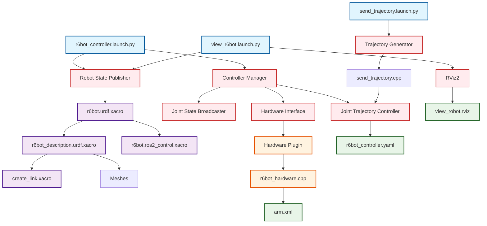

# ARM Package Structure and ROS2 Control Flow

## 📁 Complete File Structure
```
arm/
├── 📄 CMakeLists.txt              # Build configuration
├── 📄 package.xml                 # Package dependencies
├── 📄 arm.xml                     # Hardware plugin definition
├── 📄 README.md                   # Documentation
├── 📁 config/
│   ├── 📄 r6bot_controller.yaml   # Controller parameters
│   └── 📄 view_robot.rviz         # RViz configuration
├── 📁 description/
│   ├── 📁 meshes/                 # Visual meshes (STL/DAE files)
│   ├── 📁 srdf/                   # Semantic robot description
│   └── 📁 urdf/
│       ├── 📄 r6bot.urdf.xacro           # Main robot description
│       ├── 📄 r6bot_description.urdf.xacro  # Physical links/joints
│       ├── 📄 r6bot.ros2_control.xacro   # ROS2 control hardware interface
│       └── 📁 inc/
│           └── 📄 create_link.xacro      # Helper macro for links
├── 📁 hardware/
│   ├── 📄 r6bot_hardware.cpp      # Hardware interface implementation
│   └── 📁 include/
│       └── 📁 ros2_control_demo_example_7/
│           └── 📄 r6bot_hardware.hpp     # Hardware interface header
├── 📁 launch/
│   ├── 📄 r6bot_controller.launch.py    # Main controller launch
│   ├── 📄 view_r6bot.launch.py          # Visualization launch
│   └── 📄 send_trajectory.launch.py     # Trajectory sender launch
└── 📁 reference_generator/
    └── 📄 send_trajectory.cpp     # Trajectory generation utility
```

## 🔄 ROS2 Control Flow Diagram



## 🏗️ Build and Compilation Flow

```
CMakeLists.txt
├── Dependencies: hardware_interface, controller_interface, etc.
├── Executable: send_trajectory (from reference_generator/send_trajectory.cpp)
├── Library: arm_hardware (from hardware/r6bot_hardware.cpp)
└── Plugin Export: arm.xml (defines hardware plugin)

package.xml
├── Build Dependencies: ament_cmake, hardware_interface, etc.
├── Execution Dependencies: joint_trajectory_controller, etc.
└── Export: hardware_interface plugin
```

## 🎯 Component Relationships

### 1. **Robot Description Chain**
```
r6bot.urdf.xacro (main)
├── Includes: r6bot_description.urdf.xacro (physical structure)
│   └── Uses: create_link.xacro (helper macro)
│   └── References: meshes/ (visual representation)
└── Includes: r6bot.ros2_control.xacro (control interface)
    └── Plugin: arm/RobotSystem (from arm.xml)
```

### 2. **Control System Flow**
```
Launch File → Controller Manager → Hardware Interface → Physical/Simulated Robot
     ↓              ↓                    ↓
Configuration → Controllers → Hardware Plugin → Joint Commands/States
     ↓              ↓                    ↓
YAML Files → Joint Trajectory → C++ Implementation → Robot Movement
```

### 3. **Data Flow**
```
Trajectory Commands → Joint Trajectory Controller → Hardware Interface → Robot Joints
Robot Joint States ← Joint State Broadcaster ← Hardware Interface ← Robot Sensors
```

## 🚀 Launch Sequence

### Main Controller Launch (`r6bot_controller.launch.py`):
1. **URDF Processing**: Xacro processes `r6bot.urdf.xacro` → generates robot description
2. **Robot State Publisher**: Publishes robot state based on URDF
3. **Controller Manager**: Loads hardware interface and controllers
4. **Joint State Broadcaster**: Publishes joint states to `/joint_states`
5. **Joint Trajectory Controller**: Accepts trajectory commands on `/arm_controller/joint_trajectory`

### Visualization Launch (`view_r6bot.launch.py`):
1. **Robot State Publisher**: Same as above
2. **RViz2**: Launches with `view_robot.rviz` configuration

### Trajectory Sender Launch (`send_trajectory.launch.py`):
1. **Trajectory Generator**: Executes `send_trajectory` executable
2. **Sends Commands**: To joint trajectory controller

## 🔧 Key Integration Points

1. **Hardware Plugin Registration**:
   - `arm.xml` → defines plugin class `arm/RobotSystem`
   - `CMakeLists.txt` → exports plugin description
   - `r6bot.ros2_control.xacro` → references plugin

2. **Controller Configuration**:
   - `r6bot_controller.yaml` → defines controller parameters
   - Launch files → load configuration and spawn controllers

3. **Robot Description**:
   - URDF files → define robot structure and control interfaces
   - Launch files → process URDF and publish robot description

4. **Build System**:
   - `CMakeLists.txt` → compiles hardware interface and trajectory sender
   - `package.xml` → declares dependencies and exports
